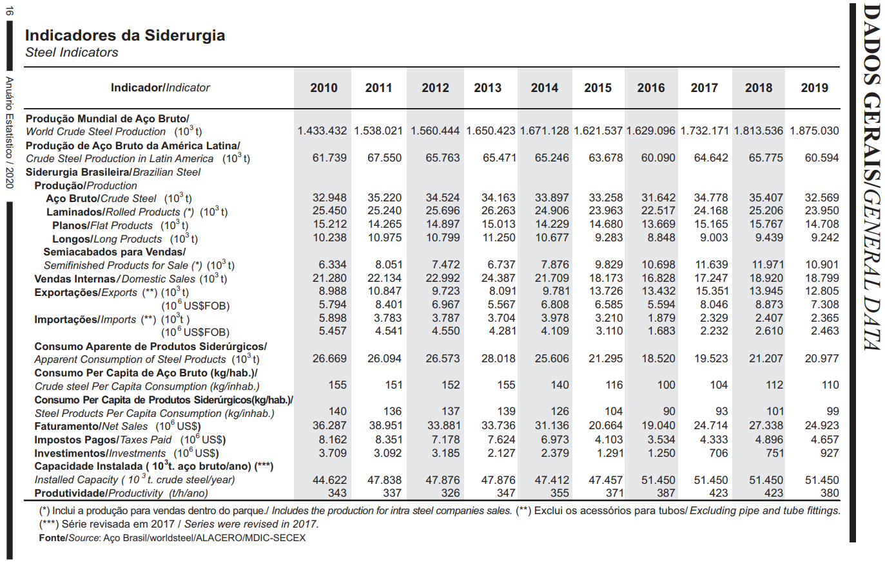
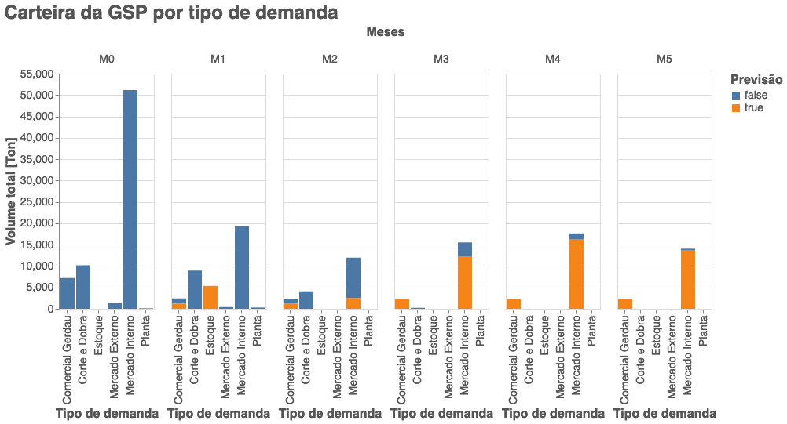

# DesafioGerdau

Ola, somos o time Jaqueline Goes, composto por:

- Camila Cestari &nbsp;
- Carla Mendes &nbsp;
- Claudia Santos &nbsp;
- Leticia Shiota &nbsp;
- Lizandra Foeguer &nbsp;
- Nara Guimaraes &nbsp;

<b>[Apresentacao Final](https://www.thinglink.com/video/1576741800243101697)</b>

Este repositorio contem a resolucao do desafio desenvolvido pela empresa Gerdau junto a WomakerCode para conclusao do bootcamp de Data Analytics.

<u>Instruções:</u>

- Descreva a abordagem utilizada na resolução.
- Trechos de códigos deverão ter comentários essenciais.
- Haverá sessão de dúvidas, direcionando o entendimento dos problemas. Não haverá comentário de solução

<b>1) Estudo do desempenho da siderurgia brasileira</b>

A indústria do aço possui grande importância na indústria de transformação brasileira, na participação do PIB e na geração de empregos. Segundo o IABr (Instituto Aço Brasil) a produção de aço bruto brasileiro atingiu 32,6 milhões de toneladas em 2019, colocando o Brasil como o 9º maior produtor de aço no mundo. Foram 112 mil colaboradores, entre próprios e terceiros, que tornaram esse resultado possível.

https://acobrasil.org.br/

O desempenho da indústria siderúrgica depende do desempenho econômico do país. E vemos isso refletido no consumo de aço interno.

Uma forma de avaliar o consumo de aço interno é através do consumo de aço aparente que é dado por

<i>Consumo Aparente = Produção de Aço + Importação de Aço - Exportação de Aço</i>

Utilizando os dados históricos disponíveis no arquivo de excel "Performance_Mensal.xls" responda as seguintes pergutas e descreva o raciocínio utilizado.

a. As exportações de aço brasileiras são representativas no mercado internacional, o Brasil foi o 12º maior exportador de produtos siderúrgicos em 2019. Qual foi o trimestre em que houve a maior exportação de aço? Qual foi o preço aproximado? É possivel identificar alguma relação entre preço e quantidade exportada?

b. Dado que o desempenho da siderurgia está ligado ao desempenho econômico do país, utilize a série histórica do consumo aparente de aço brasileiro e faça uma análise exploratória, explicando as mudanças de tendência observadas.

c. Projeções são importantes para avaliar situações futuras e realizar planejamentos. Faça uma projeção do consumo aparente de aço para os próximos 3 anos (2020 - 2022) e avalie quais fatores e/ou variáveis influenciam a projeção.

<b>2) Conhecimento Geral¶</b>

Baseado nos dados (carteira_demanda.xls) fornecidos da carteira da GSP do dia 25 de março, construa os seguintes gráficos com as bibliotecas da sua preferência (seaborn, matplotlib, Altair, etc). Tente se aproximar o máximo possível a descrição fornecida na imagem

Carteira por tipo de demanda
A GSP atende as seguintes demanda:

- Comercial Gerdau
- Corte e Dobra
- Produção para Estoque
- Mercado Externo
- Mercado Interno
- Planta/Transferência

Precisamos criar um gráfico que mostre os volumes da nossa carteira para cada mês e para cada tipo de demanda, além de ter a visão se a carteira foi predita ou ela já está implantada.

Faça uma breve descrição do gráfico e explique os filtros/tratamento nos dados
